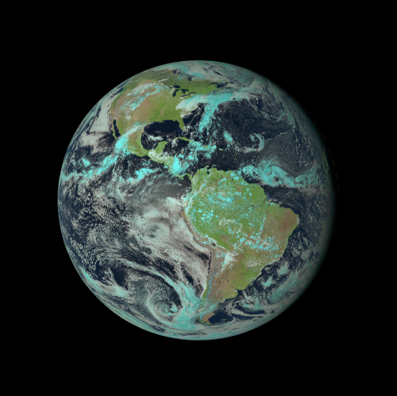
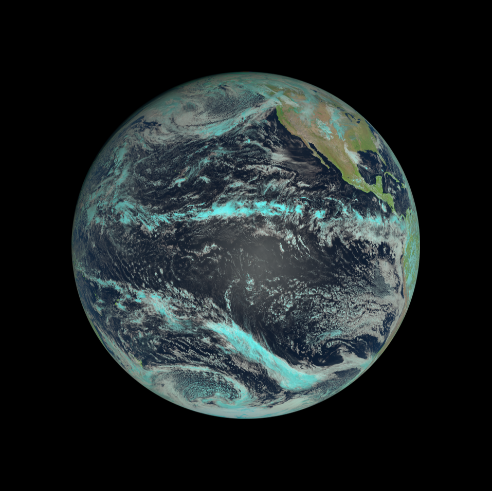
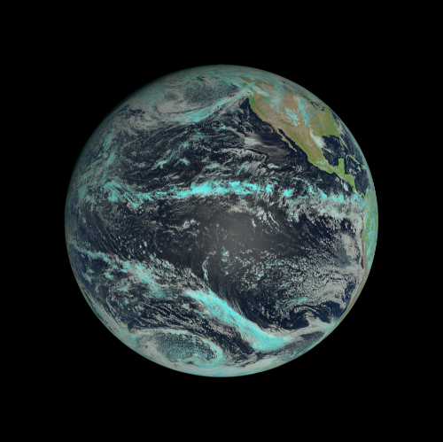
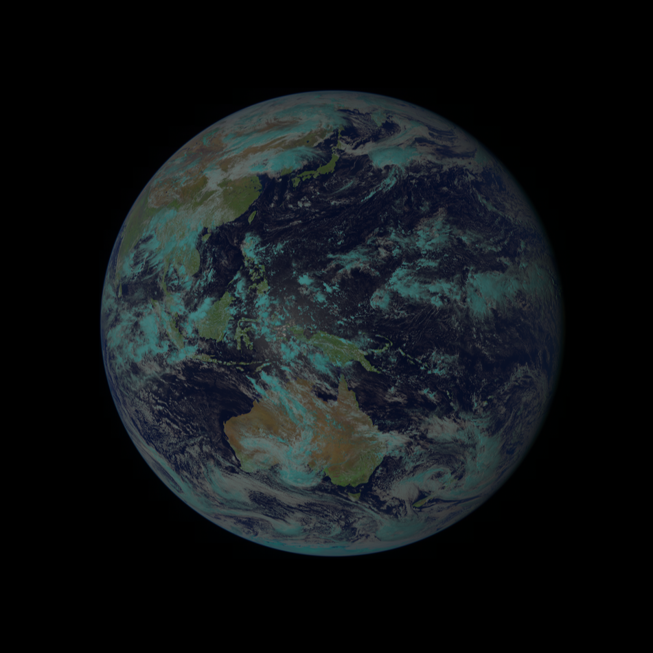
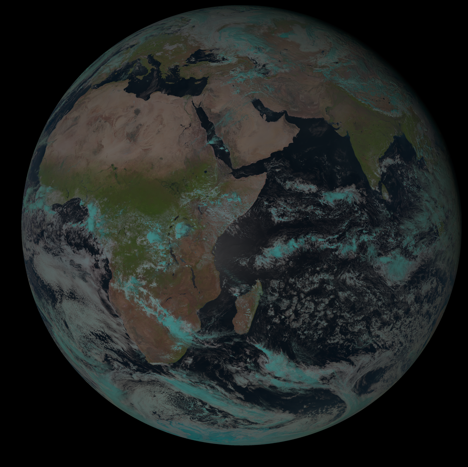
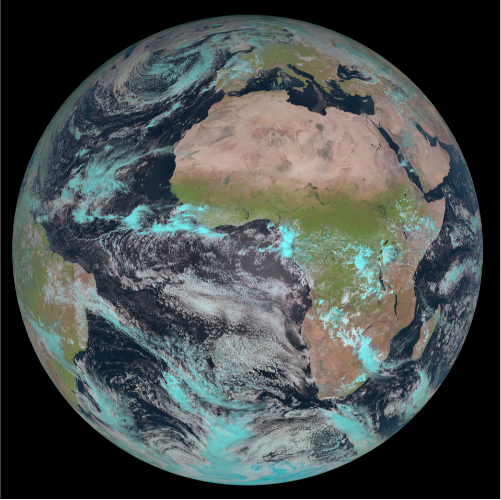

# Live-Earth-Wallpapers
Set your Desktop background to near realtime picures of the earth. \
High resolution Sentinel images supported!

### Instalation
1. `git clone https://github.com/L-Roth/Live-Earth-Wallpapers.git`
2. `python3 -m venv venv`
3. `source venv/bin/activate`
4. `pip install -r requirements.txt`
5. Test installation with: `python3 /path/to/projectDir/changeBackground.py -z 0 -s meteosat-11`. \
6. Install imagemagick for sentinel support (https://imagemagick.org/index.php)
The Image `backgroundImage.png`should have updated. 

### Updating the Image
Set a cronjob to execute the `changeBackground.py` script routinely: \
1. execute `env | grep -i display` to find your exact DISPLAY name. (probably :0 or :0.0)
2. `*/30 * * * * DISPLAY=:{your display name from 1.} python3 /path/to/ProjectDir/changeBackground.py -z 3 -s meteosat-11 -p feh`

Example: `*/30 * * * * DISPLAY=:0 python3 /path/to/ProjectDir/changeBackground.py -z 3 -s meteosat-11 -p feh` \
To update the Background you need either `feh`, `nitrogen` or `gsettings` to be installed.

### Script Parameter Options:
<pre>options:
  -h, --help            show this help message and exit
  -z {0,1,2,3,4}, --zoomLevel {0,1,2,3,4}
                        Change the ImageSize 0=678, 1=1356, 2=2712, 3=5424,
                        4=10848 (Meteosat does not support Level 4)
  -s {goes-16,goes-17,goes-18,himawari,meteosat-9,meteosat-11,sentinel}, --source {goes-16,goes-17,goes-18,himawari,meteosat-9,meteosat-11,sentinel}
                        Select Satellite as a source. goes-16, goes-17,
                        goes-18, himawari, meteosat-9, meteosat-11,
                        sentinel
  -p {feh,nitrogen,gsettings}, --bgProgram {feh,nitrogen,gsettings}
                        Select Programm to set the Background.
  -a LATITUDE, --latitude LATITUDE
                        Set the latitude of the Background image bounding
                        box you want to set. Only for Sentinel as source.
  -b LONGITUDE, --longitude LONGITUDE
                        Set the longitude of the Background image bounding
                        box you want to set. Only for Sentinel as source.
usage: changeBackground.py [-h] [-z {0,1,2,3,4}]
                           [-s {goes-16,goes-17,goes-18,himawari,meteosat-9,meteosat-11,sentinel}]
                           [-p {feh,nitrogen,gsettings}] [-a LATITUDE]
                           [-b LONGITUDE]
</pre>

### Supported Satellites:
| **Satellite** | **example Image**                     |
|---------------|---------------------------------------|
| Sentinel      | |
| Goes-16       |      |
| Goes-17       |      |
| Goes-18       |      |
| Himamwari-8   |     |
| Meteosat-9    |   |
| Meteosat-11   |  |

All Scripts in `magickScripts` are from Fred Weinhaus`s Imagemagcik Scripts. (http://www.fmwconcepts.com/imagemagick/index.php)
