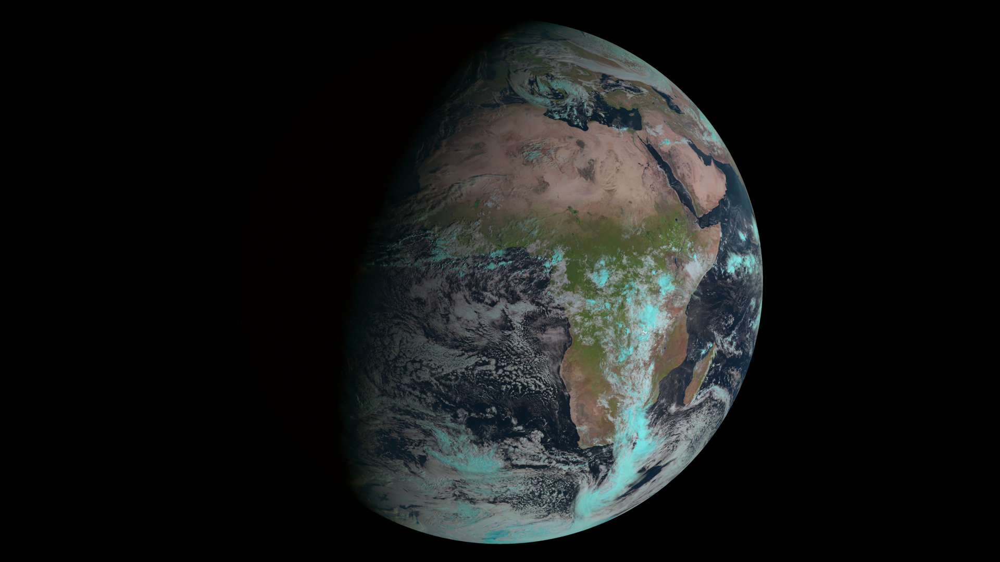
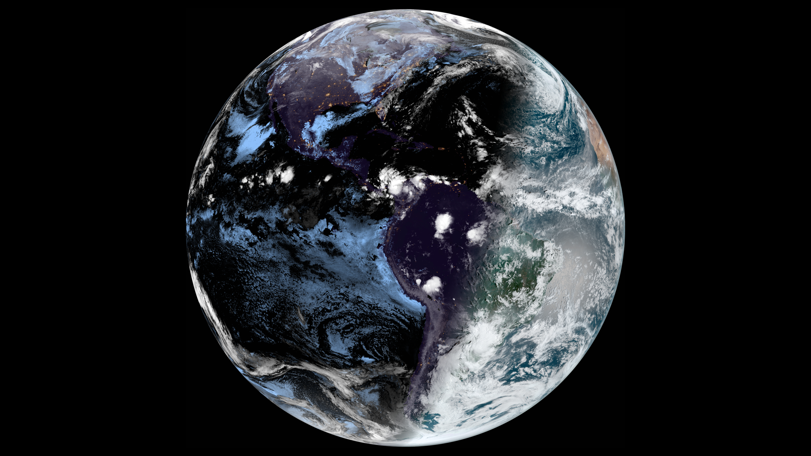
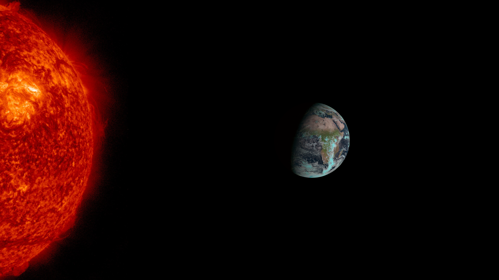
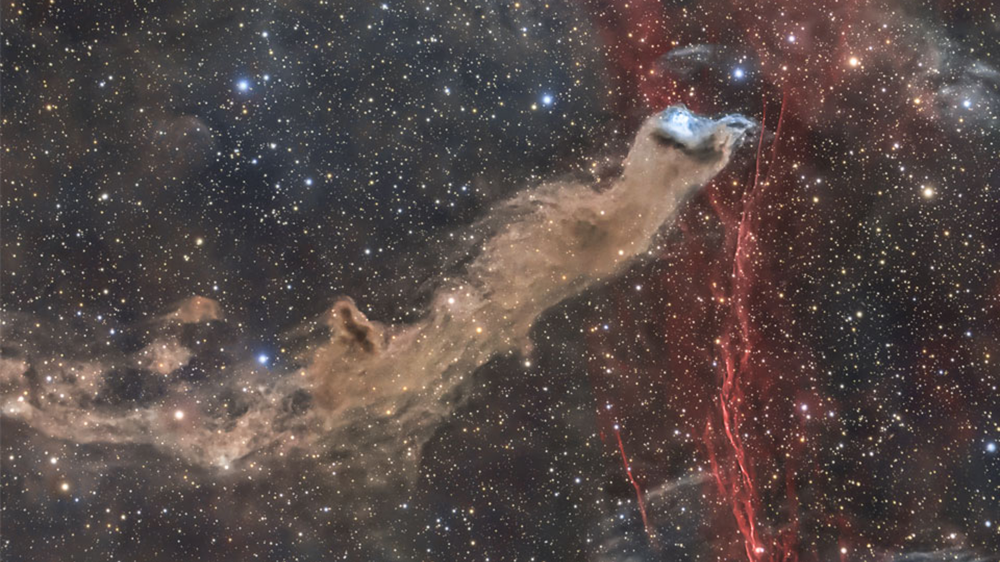

# Live-Earth-Wallpapers aka liewa
Set your Desktop background to near real-time pictures of the earth.
Supports all known **geostationary** satellites, high resolution **sentinel** images, Nasa **Solar Dynamics Observatory** images and NASA astronomy picture of the day (Apod)! For Linux, Windows and macOS!

***
## Examples

*Example Output of the config1.yml file. Use this by passing config1 to -c flag.*

*Example Output of the config2.yml file. Use this by passing config2 to -c flag.*

*Example Output of the config3.yml file. Use this by passing config3 to -c flag.*

*Example Output of the Sentinel satellite. Learn how to generate custom images for your location at the [Wiki Page](https://github.com/lennart-rth/Live-Earth-Wallpapers/wiki)*

*Example Output of the Sentinel satellite. Learn how to generate custom images for your location at the [Wiki Page](https://github.com/lennart-rth/Live-Earth-Wallpapers/wiki)*

*Example Output of the Sentinel satellite. Learn how to generate custom images for your location at the [Wiki Page](https://github.com/lennart-rth/Live-Earth-Wallpapers/wiki)*

*Example Output for astronomy picture of the day feed (apod)(2022 November 15).*
### Build images to your needs by writing your own `config.yml` file or using the GUI.
### Read more on the [Wiki Page](https://github.com/lennart-rth/Live-Earth-Wallpapers/wiki).
***
## Installation

**You need Python installed and added to your System-path-variable!**

### Using PyPi (Linux,MacOs)
1. Install liewa-software from [pypi Package](https://pypi.org/project/liewa/)
2. execute command line Interface by `liewa-cli` or the Gui by `liewa-gui`.

### Windows
1. Download the `liewaInstaller.exe` from [Releases Page](https://github.com/lennart-rth/Live-Earth-Wallpapers/releases) and execute the GUI.
2. If the desktop image hasn't changed, take a look at the [Known bugs](#Known-Bugs) section.

### Linux
1. Download the `liewa.deb` file from [Releases Page](https://github.com/lennart-rth/Live-Earth-Wallpapers/releases).
2. Execute `sudo dpkg -i liewa.deb`.

### MacOS
1. Download the `liewa.dmg` drive from the [Releases Page](https://github.com/lennart-rth/Live-Earth-Wallpapers/releases).
2. Drag and Drop the liewa software into the Program Folders.

### For detailed user guide, read the [Wiki page](https://github.com/lennart-rth/Live-Earth-Wallpapers/wiki).

## Usage
### Script Parameters:
| short | long     | type   | default                              | help                                                                 |
|-------|----------|--------|--------------------------------------|----------------------------------------------------------------------|
| -c    | --config | String | path/to/project/recources/config.yml | The absolute path to the config File. There are 3 examples preinstalled. Use them by passing `congfig1`, `config2` or `config3` as parameters.|
| -o    | --output | String | -                                    | The absolute path to a folder. All loaded Images will be saved here. |\

The composition of your background image is defined by a `config.yml` file.\
Read the [Wiki](https://github.com/lennart-rth/Live-Earth-Wallpapers/wiki) for a detailed instruction on how to personalize your image composition.

***
## For Contributers
1. Read the [Contributing Readme](CONTRIBUTING.md).
2. Filter discussions by "For Contributers" label to find topics to work on.
3. Feel free to add your own ideas, features or open a discussion in the [Discussions tab](https://github.com/lennart-rth/Live-Earth-Wallpapers/discussions).

## Known Bugs
### Pypi
1. If `liewa-cli` or `liewa-gui` is not known, add python pip itepackages to system `PATH`.
### Windows
1. On some systems the task scheduler can't automatically be set to execute the program even when the cumputer is in battery mode. Therefore you have to  uncheck this flag manually in the TaskScheduler for the `liewa` Task.
2. On some systems the python Packages need to be manually installed. Do so by typing `pip install bs4 pillow pyyaml requests` into CMD.
